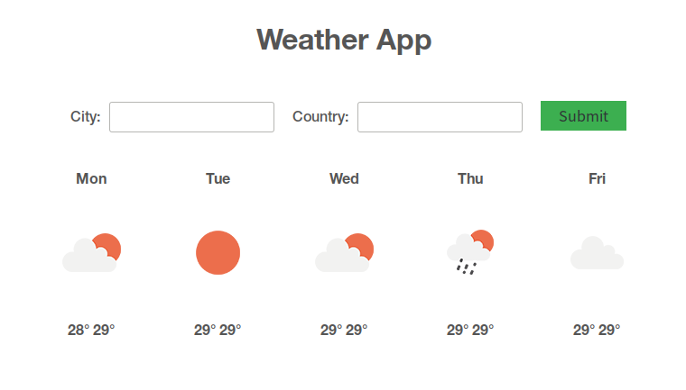
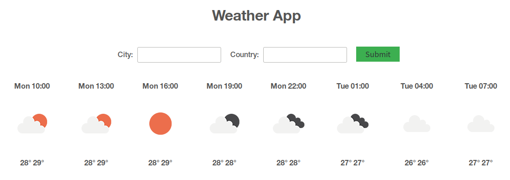
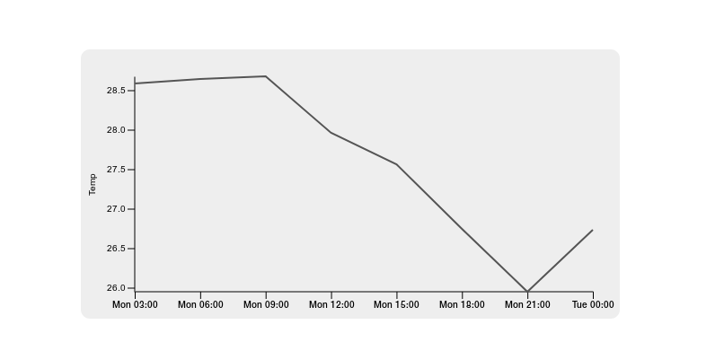

# React Weather App

Live [here](https://gifted-jennings-f4fb17.netlify.app/)

## Weekly weather 

You can click the icon to view daily weather on that particular day

## Daily weather

## Available Scripts

In the project directory, you can run:

### `npm install`

This will install all the dependencies for the project.

### `npm start`

Runs the app in the development mode. 
Open [http://localhost:3000](http://localhost:3000) to view it in the browser.

### `npm run build`

Builds the app for production to the `build` folder. 
It correctly bundles React in production mode and optimizes the build for the best performance.

